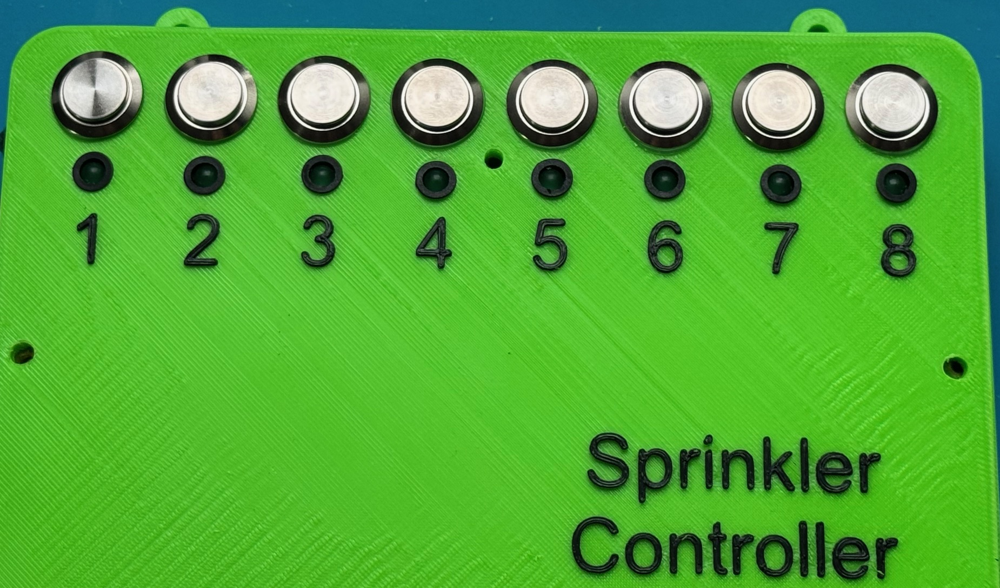

<h1>Irrigation Controller</h1>

<strong>Eight-station irrigation system</strong>, controlled manually or by schedule with <a href="https://www.home-assistant.io/" target="_blank">Home Assistant</a>.

I'm watering my garden, and instead of buying a standard controller, I decided to create my own project. This allows me to control every system parameter:

<ul>
  <li>Rainfall (counted by an external device)</li>
  <li>Sprinkler runtime</li>
  <li>Interval time between stations</li>
  <li>Custom schedules</li>
</ul>

Manual control is also available, using buttons on the housing that activate the relay. An LED indicates whether the output is actually <strong>24V AC</strong>, not just the relay itself.

<h2>Hardware used</h2>
<ul>
  <li>ESP32 module</li>
  <li>8-channel relay board</li>
  <li>2.2kΩ 2W resistors</li>
  <li>diode 1N4007</li>  
  <li>LED indicator</li>
  <li>16mm momentary switches</li>
  <li>DC power socket</li>
  <li>USB-C socket</li>
  <li>24AWG wires</li>
</ul>

The code for <strong>ESPHome</strong> is included in this repository.

<h2>Demo video</h2>

Link to a YouTube video showing the structure and operation of the controller: 
<a href="https://youtu.be/9w1ausG_DVM" target="_blank">https://youtu.be/9w1ausG_DVM</a>

<h2>Photo</h2>

